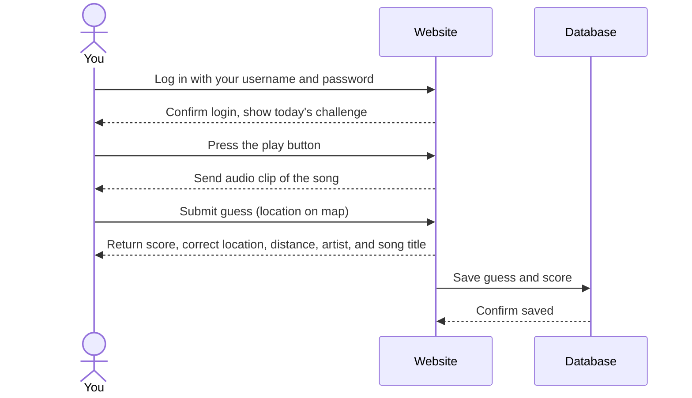

# TuneCatcher

This application, **TuneCatcher**, will combine guessing elements from the game "GeoGuessr" with music trivia. Every day, you will be given a short snippet of a song. Then, you have to guess where in the world it's from — this could range from Kenya, to Romania, to the USA, with many possibilities in between. The closer you are to the correct country and city, the more points you get. After you have made your guess, you can see how your results compare to the daily high scores. 

### Elevator pitch

Have you ever had a conversation with your friends and wondered who has better knowledge of music? TuneCatcher combines your music taste with your geography expertise. You can play it solo or turn it into a competition against others. Along the way, you are likely to learn some new geography and discover new music. 

### Design

Above are three photos that show the user interface.

1. Start up page: insert username and password.
2. Press the play button to hear a quick snippet of the song, then choose your guess on the map.
3. After you submit, you will be brought to a page that tells you more information. This includes the origin of the song, how far away you were from that location, as well as the artist, song title, and your score.

---

Featured below is a sequence diagram. This shows how the user would interact with the website and the database that stores the daily high scores. 

### Key features

- Secure login with username and password
- Daily refresh of a new song
    - This song then plays on the website
- Combining geography with music trivia
    - Guess the song's location by dropping a pin on the map. The closer you are the more points you earn.
    - This helps you to discover music from diverse countries and cultures
- Storage of user scores in a database
- Real-time leaderboard that shows the top 3 daily high scores

### Technologies

I am going to use the required technologies in the following ways:

- **HTML** - HTML will be used to create the elements on the screen (buttons, containers, forms). In the case of TuneCatcher that would include the play button, the results page and the container for the map. 

- **CSS** - CSS will be used for my color scheme to make sure that it is cohesive and pleasing too look at. Additionally, this is where I will make sure that the application looks good on different screen sizes.

- **React** - React will be used with my live score display. This will update the user interface instantly without needing to be refreshed. Also, this will be used for changing between the login page, gameplay page, and the result page.  

- **Service** - There will be backend service with endpoints for:
    - User authentication
    - Retrieving the daily song
    - Submitting a guess
    - Calculating the score based on distance from the actual location of the song

- **DB/Login** - DB/Login will be used to store user accounts, game history, and song data. The database data being displayed will come from the daily high score.

- **WebSocket** - Websocket will help with the live leaderboard. Every time a player submits their guess, it will be instantly pushed to the real-time leaderboard. 

- **3rd party API** - There will be multiple used for this application.
    - Leaflet.js - this will be for the map. (its free, unless I change my mind and use Google Maps JavaScript API)
    - Deezer API - this is free and allows for 30-second audio previews.

## 🚀 Specification Deliverable

> [!NOTE]
> Fill in this sections as the submission artifact for this deliverable. You can refer to this [example](https://github.com/webprogramming260/startup-example/blob/main/README.md) for inspiration.

For this deliverable I did the following. I checked the box `[x]` and added a description for things I completed.

- [x] I completed the prerequisites for this deliverable (Git commit requirement)
- [x] Proper use of Markdown
- [x] A concise and compelling elevator pitch
- [x] Description of key features
- [x] Description of how you will use each technology including your 3rd party API and use of WebSocket
- [x] One or more rough sketches of your application. Images must be embedded in this file using Markdown image references.

## 🚀 AWS deliverable

For this deliverable I did the following. I checked the box `[x]` and added a description for things I completed.

- [ ] **Rented EC2 server** - I did not complete this part of the deliverable.
- [ ] **Leased domain name** - I did not complete this part of the deliverable.
- [ ] **Server accessible** from my domain: [https://yourdomainnamehere.click](https://yourdomainnamehere.click) - I did not complete this part of the deliverable.

## 🚀 HTML deliverable

For this deliverable I did the following. I checked the box `[x]` and added a description for things I completed.

- [ ] I completed the prerequisites for this deliverable (Simon deployed, GitHub link, Git commits)
- [ ] **HTML pages** - I did not complete this part of the deliverable.
- [ ] **Proper HTML element usage** - I did not complete this part of the deliverable.
- [ ] **Links** - I did not complete this part of the deliverable.
- [ ] **Text** - I did not complete this part of the deliverable.
- [ ] **3rd party API placeholder** - I did not complete this part of the deliverable.
- [ ] **Images** - I did not complete this part of the deliverable.
- [ ] **Login placeholder** - I did not complete this part of the deliverable.
- [ ] **DB data placeholder** - I did not complete this part of the deliverable.
- [ ] **WebSocket placeholder** - I did not complete this part of the deliverable.

## 🚀 CSS deliverable

For this deliverable I did the following. I checked the box `[x]` and added a description for things I completed.

- [ ] I completed the prerequisites for this deliverable (Simon deployed, GitHub link, Git commits)
- [ ] **Visually appealing colors and layout. No overflowing elements.** - I did not complete this part of the deliverable.
- [ ] **Use of a CSS framework** - I did not complete this part of the deliverable.
- [ ] **All visual elements styled using CSS** - I did not complete this part of the deliverable.
- [ ] **Responsive to window resizing using flexbox and/or grid display** - I did not complete this part of the deliverable.
- [ ] **Use of a imported font** - I did not complete this part of the deliverable.
- [ ] **Use of different types of selectors including element, class, ID, and pseudo selectors** - I did not complete this part of the deliverable.

## 🚀 React part 1: Routing deliverable

For this deliverable I did the following. I checked the box `[x]` and added a description for things I completed.

- [ ] I completed the prerequisites for this deliverable (Simon deployed, GitHub link, Git commits)
- [ ] **Bundled using Vite** - I did not complete this part of the deliverable.
- [ ] **Components** - I did not complete this part of the deliverable.
- [ ] **Router** - I did not complete this part of the deliverable.

## 🚀 React part 2: Reactivity deliverable

For this deliverable I did the following. I checked the box `[x]` and added a description for things I completed.

- [ ] I completed the prerequisites for this deliverable (Simon deployed, GitHub link, Git commits)
- [ ] **All functionality implemented or mocked out** - I did not complete this part of the deliverable.
- [ ] **Hooks** - I did not complete this part of the deliverable.

## 🚀 Service deliverable

For this deliverable I did the following. I checked the box `[x]` and added a description for things I completed.

- [ ] I completed the prerequisites for this deliverable (Simon deployed, GitHub link, Git commits)
- [ ] **Node.js/Express HTTP service** - I did not complete this part of the deliverable.
- [ ] **Static middleware for frontend** - I did not complete this part of the deliverable.
- [ ] **Calls to third party endpoints** - I did not complete this part of the deliverable.
- [ ] **Backend service endpoints** - I did not complete this part of the deliverable.
- [ ] **Frontend calls service endpoints** - I did not complete this part of the deliverable.
- [ ] **Supports registration, login, logout, and restricted endpoint** - I did not complete this part of the deliverable.
- [ ] **Uses BCrypt to hash passwords** - I did not complete this part of the deliverable.

## 🚀 DB deliverable

For this deliverable I did the following. I checked the box `[x]` and added a description for things I completed.

- [ ] I completed the prerequisites for this deliverable (Simon deployed, GitHub link, Git commits)
- [ ] **Stores data in MongoDB** - I did not complete this part of the deliverable.
- [ ] **Stores credentials in MongoDB** - I did not complete this part of the deliverable.

## 🚀 WebSocket deliverable

For this deliverable I did the following. I checked the box `[x]` and added a description for things I completed.

- [ ] I completed the prerequisites for this deliverable (Simon deployed, GitHub link, Git commits)
- [ ] **Backend listens for WebSocket connection** - I did not complete this part of the deliverable.
- [ ] **Frontend makes WebSocket connection** - I did not complete this part of the deliverable.
- [ ] **Data sent over WebSocket connection** - I did not complete this part of the deliverable.
- [ ] **WebSocket data displayed** - I did not complete this part of the deliverable.
- [ ] **Application is fully functional** - I did not complete this part of the deliverable.
